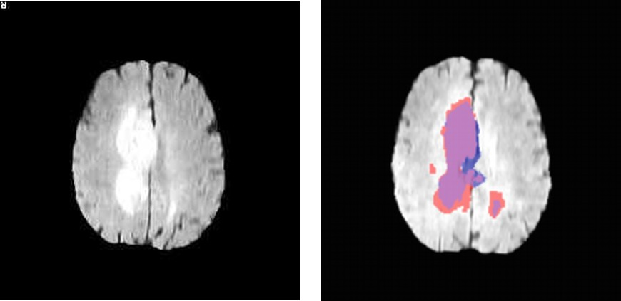
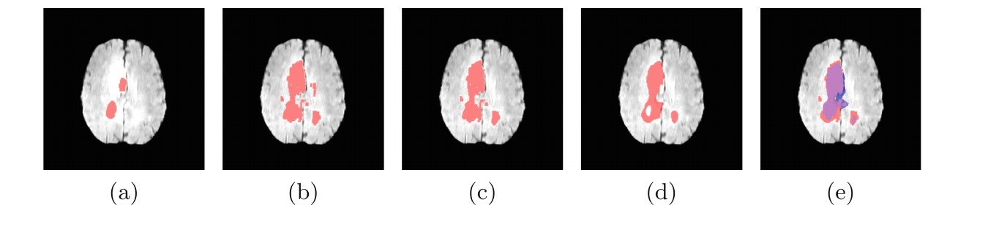

# Why build a language?

*Lecture 1, part A. This chapter is motivation: it is not part of the exam programme.*

You already know how to write a program. So why would anyone build a **language**
instead of just writing the program?

This chapter answers with a little history and one real case. The history is older than
computers. The case is one I have worked on for about ten years, and it is what
convinced me that the question deserves a course.

## Languages were formal before they were programmed

In 1956 Noam Chomsky, a linguist, proposed to treat a language as a **set of strings**
and a **grammar** as a finite device that generates it. He was studying English, not
computers. Grammars, he showed, come in a hierarchy — regular, context-free,
context-sensitive, unrestricted — and each level has its own kind of machine that can
recognise it. A year after *Syntactic Structures* (1957), the report on ALGOL 60 defined a
programming language with a context-free grammar, written in what we now call
Backus–Naur form. Every parser you will write in this course descends from that idea.

Chomsky also gave us the sentence *colorless green ideas sleep furiously*: grammatically
perfect, and meaningless. A grammar tells you which sentences **exist**. It does not tell
you what they **mean**. Computational linguistics has lived with that split ever since,
with parsing on one side and semantics on the other. So will we. The grammar of a small
language takes one lecture; its meaning takes the rest of the course.

Shakespeare's Juliet says that a rose by any other name would smell as sweet. Semantics
is the opposite discipline: the art of giving **meaning to symbols**, and of making sure
that two people — or a person and a machine — mean the same thing by them.

## Knowledge, written down

For thirty years "artificial intelligence" meant **writing knowledge in a language**.
LISP appeared in 1958 and Prolog in 1972; the rule-based expert systems of the 1970s
were programs whose knowledge was a list of rules a person had typed. MYCIN chose
antibiotics for blood infections from about six hundred such rules, and could show the
rules behind each answer. Readable and checkable — and laborious, because someone has to
write every rule.

Machine learning makes the opposite trade. Nobody writes the rules, and nobody can read
them. That trade is what makes the question of this chapter urgent again.

This is not a course on artificial intelligence. It teaches the other half: how to
design the language in which something can be written down, read, and checked. The two
halves are complementary, and we will come back to how they fit together.

## One real case: drawing a tumour



Before radiotherapy, someone has to draw the tumour on a magnetic resonance scan: which
voxels are tumour, which are not. A human does it, slice by slice. It is slow, it is
tiring, and different experts draw different boundaries.

This is an obvious task for automation, and in the literature it *is* automated. A yearly
international challenge on brain tumour segmentation has run since 2012. In 2017 it
attracted about fifty papers, essentially all of them machine learning, some with
excellent results. And almost none of that work was used in a clinical workflow.

The reasons are not about accuracy.

- **Accountability.** Who is responsible when the contour is wrong?
- **Compliance.** Contouring guidelines are published and updated. Does the program follow
  them? How would you check?
- **Quality assurance.** Can you certify a procedure you cannot read?
- **Innovation.** A genuinely new idea has, by definition, no training data behind it.

All four are questions about **whether a person can read the procedure**. A trained
network is a large array of numbers. There is nothing in it to read, to argue with, or to
hand to a clinician for approval.

## So we built a language

Our answer, with colleagues at CNR in Pisa and a hospital in Lucca, was VoxLogicA: write
the contour in a very high-level language that a radiologist can read, and let an
interpreter optimise and execute the description. Here is the heart of a specification
for glioblastoma:

```
let brain        = !touch(flair <. 0.1, border)
let pflair       = percentiles(flair, brain, 0.5)
let hyperIntense = flt(5.0, pflair >. 0.95)
let veryIntense  = flt(2.0, pflair >. 0.86)
let tumour       = grow(hyperIntense, veryIntense)
```

Read it aloud. The brain is whatever does not touch the border of the image. Normalise
the intensity to percentile ranks within the brain. The tumour is the brightest five
percent, grown into the brightest fourteen percent around it. A radiologist can read that
sentence, and can disagree with it: *fourteen is too much, use ten*. You cannot disagree
with a weight matrix.

Now look at the vocabulary. It is not `for`, `while`, `array`, `float`. It is `touch`,
`grow`, `near`, `percentiles`, *distance from*, *largest connected component*. These are
**the operations of the domain**, promoted to primitives of the language. That is what
makes it a domain-specific language rather than a library with a fancy name. Choosing
those words took years. Implementing them took much less.



It worked. On about two hundred cases from the 2017 challenge the accuracy was in line
with the state of the art, machine learning included; each 3D image took five to ten
seconds on a desktop computer; and the whole procedure is a page of readable text.

Then it travelled. The same vocabulary was reused for skin lesions, for white and grey
matter, for video streams, for 3D meshes. **A program solves one problem. A language
solves the ones you had not thought of yet.**

How this language actually works — the logic behind the primitives, the interpreter with
its memoisation and parallel execution, what a readable language let us discover about
accuracy scores, and how the second version works together with neural networks — is a
chapter of its own, at the end of the course, when you will have built interpreters
yourselves. Today you only need the moral.

## The moral

A domain-specific language is how a person keeps hold of an automatic system: a small,
readable, inspectable, re-runnable vocabulary that someone designed on purpose.

That is true whoever — or whatever — writes the programs. An assistant that writes in a
vocabulary you chose is one whose output you can check. Language design and artificial
intelligence are complementary, and this course is about the language half.

This is the thesis of the course. It is a position, not a theorem: argue with it.

## The uncomfortable half

An interpreter for a small language is, today, a couple of hours of work with an
assistant. Writing it is no longer the hard part, and this course will not pretend
otherwise: you are expected to use those tools.

What does not get cheaper:

- knowing **which** primitives belong in the language, and which do not;
- knowing **what each one means**, exactly, including at the edges;
- showing a case where your language earns its keep;
- saying **what it cannot do**.

By the end of the course you should believe three things. A language is a way of keeping
a human in control of an automatic system. Building one is now cheap, but deciding what
goes in it is not. And that decision — what to make expressible, and what to leave out —
is the actual content of this course.

## Further reading

- N. Chomsky. *Three models for the description of language.* IRE Transactions on
  Information Theory 2(3), 1956; and *Syntactic Structures*, Mouton, 1957.
- P. Naur (ed.). *Report on the algorithmic language ALGOL 60.* Communications of the ACM
  3(5), 1960.
- B. Buchanan, E. Shortliffe (eds.). *Rule-Based Expert Systems: The MYCIN Experiments.*
  Addison-Wesley, 1984.
- G. Belmonte, V. Ciancia, D. Latella, M. Massink. *VoxLogicA: A Spatial Model Checker
  for Declarative Image Analysis.* TACAS 2019, LNCS 11427, 281–298.
